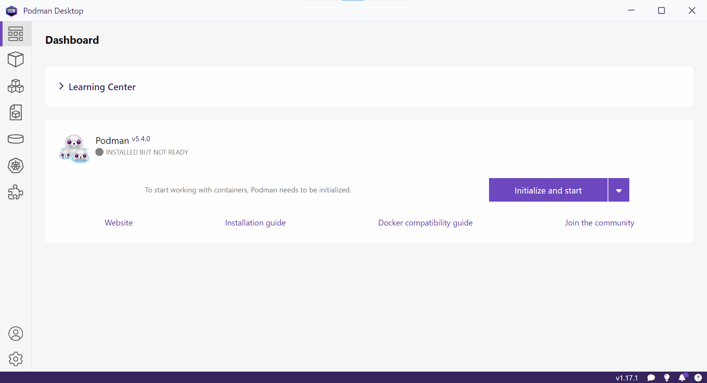

Concepts
========

This concepts are related with the tabs on the left side of Podman Desktop.

Container Image
---------------

A container image is defined in `"A Practical Introduction to Container Terminology" by Scott McCarty <https://developers.redhat.com/blog/2018/02/22/container-terminology-practical-introduction>`_ as

    A container image [...] is a file which is pulled down from a Registry Server and used locally as a mount point when starting Containers.

Registry Server
---------------

A registry server is defined in `"A Practical Introduction to Container Terminology" by Scott McCarty <https://developers.redhat.com/blog/2018/02/22/container-terminology-practical-introduction>`_ as

    A registry server is essentially a fancy file server that is used to store [...] repositories.

Container
--------- 

A container image is defined in the `"A Practical Introduction to Container Terminology" by Scott McCarty <https://developers.redhat.com/blog/2018/02/22/container-terminology-practical-introduction>`_ as

    A container is the runtime instantiation of a Container Image. A container is a standard Linux process [...]

Volume
------

`A volume is defined in the Kubernetes documentation <https://kubernetes.io/docs/concepts/storage/volumes/>`_ as

    a way for containers [...] to access and share data via the filesystem.

Pod
---

`A pod is defined in the Kubernetes documentation <https://kubernetes.io/docs/concepts/workloads/pods/>`_ as

    A Pod (as in a pod of whales or pea pod) is a group of one or more containers, with shared storage and network resources, and a specification for how to run the containers.

Create a pod by running

.. code:: bash

    podman pod create pod-name

Start the pod by running

.. code:: bash

    podman pod start pod-name

Add a container to the pod by running

.. code:: bash

    podman create \
    --pod pod-name \
    --name container-name \
    image

Start the container by running

.. code:: bash

    podman start \
    container-name

Example
^^^^^^^

.. code:: bash

    podman pod create tutorial
    podman pod start tutorial
    podman create \
        --pod tutorial \
        --name hello \
        quay.io/podman/hello:latest
    podman start \
        --attach \
        hello

outputs ::

    !... Hello Podman World ...!
    
             .--"--.           
           / -     - \         
          / (O)   (O) \        
       ~~~| -=(,Y,)=- |         
        .---. /`  \   |~~      
     ~/  o  o \~~~~.----. ~~   
      | =(X)= |~  / (O (O) \   
       ~~~~~~~  ~| =(Y_)=-  |   
      ~~~~    ~~~|   U      |~~ 
    
    Project:   https://github.com/containers/podman
    Website:   https://podman.io
    Desktop:   https://podman-desktop.io
    Documents: https://docs.podman.io
    YouTube:   https://youtube.com/@Podman
    X/Twitter: @Podman_io
    Mastodon:  @Podman_io@fosstodon.org
