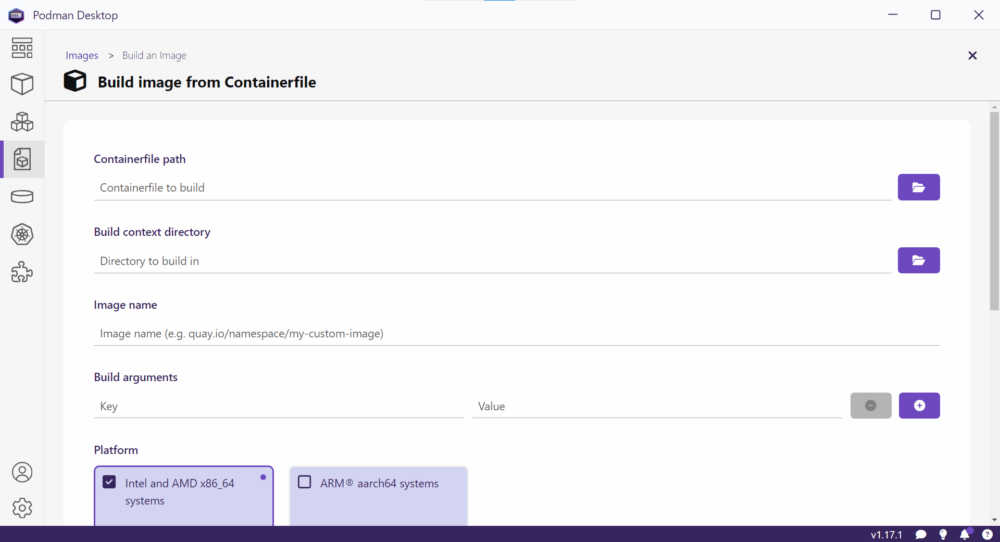

Building Images
===============

The steps of creating a container image can be stored in a plain text file commonly named ``Containerfile`` or ``Dockerfile``. The syntax for ``Containerfile`` or ``Dockerfile`` is published by Docker Inc as the `Dockerfile reference <https://docs.docker.com/reference/dockerfile/>`_.

.. note::

    It is recommended to name the file ``Dockerfile`` to keep it compatible with the ``docker`` command line interface.

.. important::

    To avoid copy files by mistake to the container image, a file named ``.containerignore`` or ``.dockerignore`` should be used. It is recommended to name the file ``.dockerignore`` to keep it compatible with the ``docker`` command line interface.

Workflow
--------

Given a ``Dockerfile``, the container image can be created from ``Images > Build an Image``.

Container image can also be created from the command line.

.. code:: bash

    podman build \
    --tag registry/namespace/repository:tag \
    context

.. note::

    ``registry``
        it is the location of the container image registry. For example ``docker.io`` for `Docker Hub <https://hub.docker.com/>`_ and ``quay.io`` for `Red Had's Quay <https://quay.io/>`_.

    ``namespace``
        it is usually represents a user or organization.

    ``repository``
        it is the mandatory identifier for the container image.

    ``tag``
        it is the optional identifier for variant of the container image.

    ``context``
        it is the directory where the ``Dockerfile`` is located.

Example
^^^^^^^

Given the following ``Dockerfile``

.. literalinclude:: examples/python0/Dockerfile
   :language: dockerfile

Running

.. code:: bash

    podman build \
    --tag my-tutorial/python:3.12 \
    examples/python0

creates a container image named ``my-tutorial/python:3.12`` that has Python installed.
