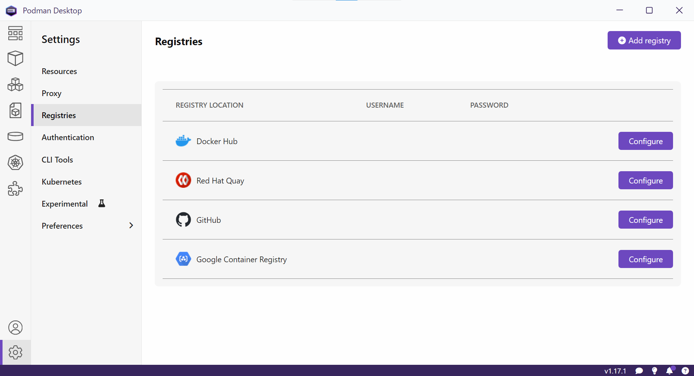
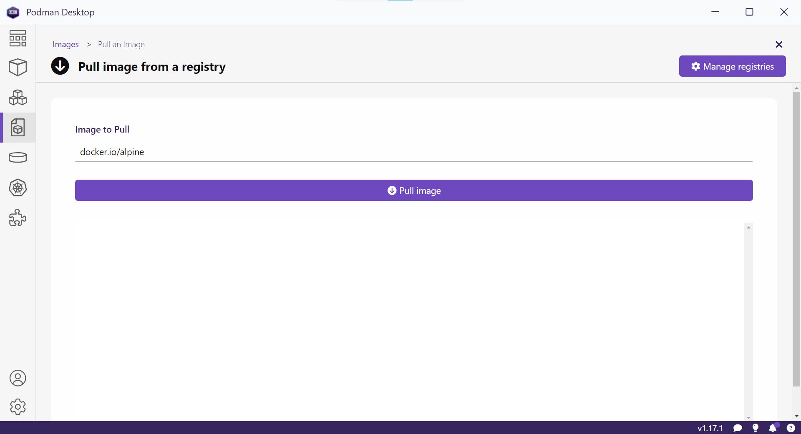

Retrieving Images
=================

Container images can be retrieved from a registry server.

Authenticating with Registry Server
-----------------------------------

.. important::

    It is recommended to authenticate with the registry server that will be used to avoid problems due API limit.

Podman Desktop is agnostic regarding the registry server and the authentication can be done from ``Settings > Registries``.

Authentication can also be done from the command line. ::

    podman login registry

Example
^^^^^^^

::

    podman login docker.io

outputs ::

    Username: jane.doe
    Password: 
    Login Succeeded!

Pulling Images
--------------

Podman Desktop is agnostic regarding the registry server from where the container image will be pulled from. Pull an image can be done from ``Images > Pull an Image``.

Pull an image can also be done from the command line. ::

    podman pull registry/namespace/repository:tag

.. note::

    ``registry``
        it is the location of the container image registry. For example ``docker.io`` for `Docker Hub <https://hub.docker.com/>`_ and ``quay.io`` for `Red Had's Quay <https://quay.io/>`_.

    ``namespace``
        it is usually represents a user or organization.

    ``repository``
        it is the mandatory identifier for the container image.

    ``tag``
        it is the optional identifier for variant of the container image.

    ``context``
        it is the directory where the ``Dockerfile`` is located.

Example
^^^^^^^

::

    podman pull docker.io/debian:12.10-slim

outputs ::

    Trying to pull docker.io/library/debian:12.10-slim...
    Getting image source signatures
    Copying blob 6e909acdb790 done   | 
    Copying config 8077017cbb done   | 
    Writing manifest to image destination
    8077017cbbd13f5681ee6b4d5463ab5a436a70d63cd99340a15f6c3a65564960  
