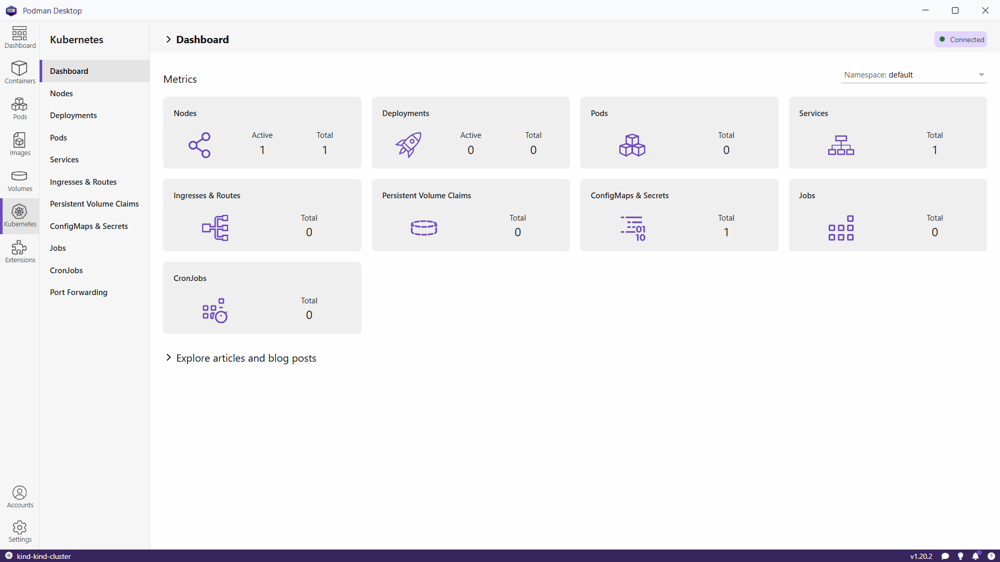

Kubernetes in Docker (kind)
===========================

`kind`_ is a tool for running local `Kubernetes`_ clusters using container "nodes".
`Podman Desktop`_ can help you run a local `Kubernetes`_ cluster using `kind`_.

Create New Cluster
------------------

1.  Select the Kubernetes tab.

2.  **If no Kubernetes cluster is configured**,
    the Kubernetes tab offers the the option to create a new `kind`_ cluster.

    ..  image:: ./img/podman-desktop-kubernetes.png
        :alt: Screenshot of Podman Desktop with the Kubernetes tab selected.

    Click in "Create new".
3.  It is possible to customise a few values (for example, :ref:`multi-node cluster <multi-node-cluster>`) but the default values are OK. 

    ..  image:: ./img/podman-desktop-kubernetes-kind-create.png
        :alt: Screenshot of Podman Desktop with the kind form.

    Click "Create".

4.  It might take a couple of minutes for `Podman`_ to download the containers. If all goes well, you will see the message "Successful operation".

    ..  image:: ./img/podman-desktop-kubernetes-kind-success.png
        :alt: Screenshot of Podman Desktop with the success message after create a kind cluster.

    Click in "Go back to resources".

Dashboard
---------

After create your Kubernetes cluster, you can see a summary of it in the the dashboard subtab.

Change Kubernetes Context
-------------------------

If you have more than one Kubernetes cluster, you can change the context used by Podman clicking in the `Kubernetes`_ icon on the left bottom corner of the window.

Using kubectl
-------------

The access to the `Kubernetes`_ cluster is done using `kubectl`_ and the `kubeconfig`_ file. The `kubeconfig`_ file is located in ``~/.kube/config``.

..  note::

    If you are using Windows, the `kubeconfig`_ file is located in ``%USERPROFILE%\.kube\config``.

..  note::

    If you are using `WSL`_, you will have to copy the `kubeconfig`_ file from Windows.

1.  Check the context.

    ..  code:: bash

        kubectl config current-context

    ::

        kind-kind-cluster

2.  Check the connection to the `Kubernetes`_ cluster.

    ..  code:: bash

        kubectl cluster-info

    ::

        Kubernetes control plane is running at https://127.0.0.1:56038
        CoreDNS is running at https://127.0.0.1:56038/api/v1/namespaces/kube-system/services/kube-dns:dns/proxy

        To further debug and diagnose cluster problems, use 'kubectl cluster-info dump'.

.. _multi-node-cluster:

Multi-node Cluster
------------------

You can use a configuration like

..  code:: yaml

    kind: Cluster
    apiVersion: kind.x-k8s.io/v1alpha4
    nodes:
      - role: control-plane
      - role: worker
      - role: worker